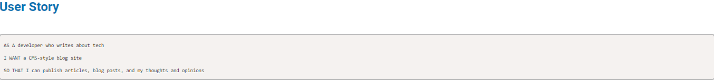
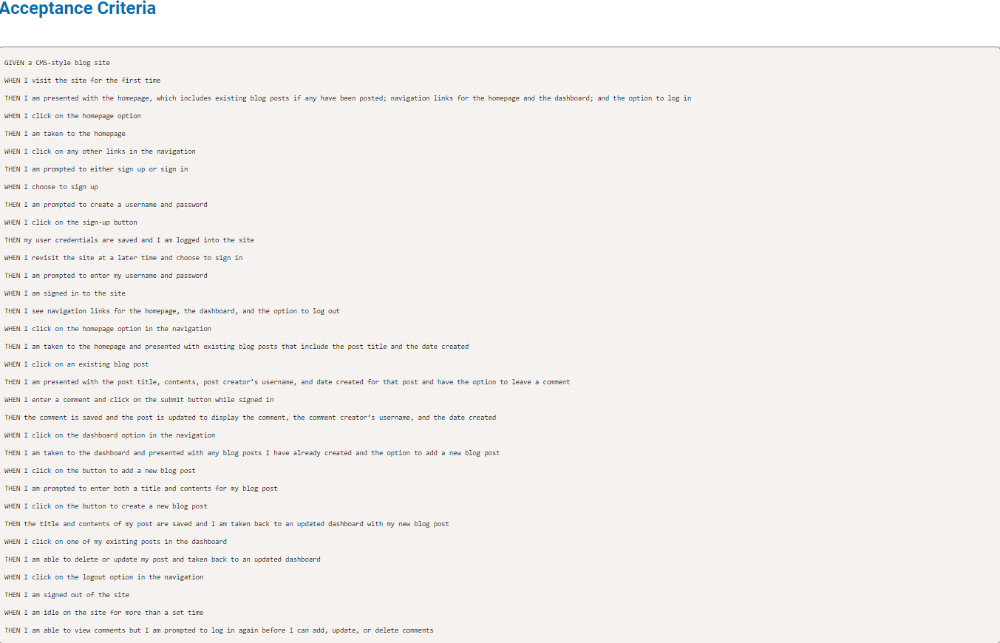

# Tech-blog

## *Table of Contents*
 ___
  - [Installation](#description)
  - [Usage](#usage)
  - [Software](#software)
  - [License](#license)
  - [Questions](#questions)
  - [Screenshots](#screenshots)

## *Description*
___
Tech-blog is a website allowing users to post blogs, read about other posted tech blogs as well as leave comments on any existing blogs.
In order to access these features user must be logged in.

## *Usage*

## *Software*
___
Projeect_name was built/deployed using the following:
- VSCode
- Gitbash/Github
- Heroku
- MySQL
- Node JS
  - NPM
  - Sequelize(Object Relational Mapping)
  - Handlebars
  - Express
    - express-session
    - express-handlebars
    - express-session-sequelize
    - connect-session-sequelize
  - mysql2
  - bcrypt
  - dotenv
- HTML
- CSS
  - Bootstrap
- Javascript
  - JQuery
- MVC paradigm (Model-View-Controller)
- OOP (Object Oriented Programming)

## *License*
___
This application is covered under the MIT license.
For more information about this license please visit https://opensource.org/licenses/MIT

## *Questions*
___
For comments/concerns please contact us at https://github.com/Jelenarog/Tech-blog  
Deployed website: https://serene-bayou-31049.herokuapp.com/

## *Screenshots*
___
Homepage

Dashboard

